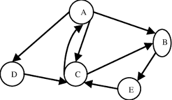

### **Part 1: Steps for Social Media Text Analytics**

Social Media Text Analytics is the process of deriving high-quality information and actionable business insights from unstructured text data found on social media platforms (like tweets, comments, reviews, and posts). 

The process generally follows these five sequential steps:

**1. Data Collection (Harvesting)**
* **Description:** The first step involves gathering the raw, unstructured text data from targeted social media channels. 
* **Process:** This is typically done using Application Programming Interfaces (APIs), web scraping tools, or third-party social media listening platforms. The data extracted can include posts, comments, hashtags, and metadata (timestamps, author IDs).

**2. Text Preprocessing and Cleaning**
* **Description:** Raw social media text is highly unstructured, noisy, and filled with slang. Preprocessing cleans the data to make it machine-readable.
* **Key Techniques:**
    * **Tokenization:** Breaking down sentences into smaller units called tokens (individual words).
    * **Stop-Word Removal:** Removing common but meaningless words like \"and,\" \"the,\" \"is,\" etc.
    * **Stemming and Lemmatization:** Reducing words to their base or root form (e.g., converting \"running\" and \"ran\" to \"run\").
    * **Noise Removal:** Stripping out URLs, special characters, HTML tags, and correcting misspelled words.

**3. Feature Extraction (Text Transformation)**
* **Description:** Algorithms cannot process raw text; they require numbers. This step involves converting the cleaned text into numerical representations.
* **Key Techniques:** Methods like **Bag-of-Words (BoW)** or **TF-IDF (Term Frequency-Inverse Document Frequency)** are used to assign numerical weights to words based on their frequency and importance within the dataset.

**4. Text Analysis and Modeling**
* **Description:** This is the core analytical phase where Natural Language Processing (NLP) and machine learning algorithms are applied to the numerical data to extract insights.
* **Common Applications:**
    * **Sentiment Analysis:** Determining whether the text expresses a positive, negative, or neutral emotion.
    * **Topic Modeling:** Automatically identifying the main themes or topics discussed within a large volume of text.
    * **Named Entity Recognition (NER):** Identifying and categorizing key entities like names of people, brands, or locations.

**5. Visualization and Interpretation**
* **Description:** The final numerical outputs and insights are translated into visually appealing, easy-to-understand formats for business stakeholders.
* **Process:** Creating dashboards, **Word Clouds** (where frequently used words appear larger), sentiment distribution charts, and topic clusters to make strategic business decisions.

---

### **Part 2: Static vs. Dynamic Text Analytics**

Text analytics can be broadly categorized into two types based on the timeframe and flow of the data being analyzed:

**1. Static Text Analytics**
* **Definition:** Static text analytics involves the analysis of a **fixed, historical dataset** that has been collected over a specific period in the past. The data is downloaded, stored locally, and does not change during the analysis.
* **Characteristics:** * It provides a \"snapshot\" of user opinions at a specific point in time.
    * It allows for deep, complex, and highly accurate analysis because time and processing speed are not major constraints.
* **Use Cases:** Conducting post-campaign analysis (e.g., analyzing all tweets generated during a one-month marketing campaign), identifying historical market trends, or performing a quarterly brand health review.

**2. Dynamic (Real-Time) Text Analytics**
* **Definition:** Dynamic text analytics involves the continuous analysis of a **live stream of incoming text data** in real-time or near real-time as users post it online. 
* **Characteristics:**
    * The data is constantly moving and updating. 
    * The focus is on processing speed and immediate insight generation rather than deep, time-consuming historical modeling.
* **Use Cases:** Crisis management (detecting a sudden spike in negative sentiment to address a PR disaster immediately), live event monitoring (tracking audience reactions during a live sports broadcast or product launch), and immediate customer service response on platforms like X (Twitter).

**Summary for Exams:**
To extract value from text, analysts must **collect, clean, transform, model, and visualize** the data. When they apply these steps to historical data, it is **Static** analytics; when they apply them to a live data stream for immediate action, it is **Dynamic** analytics.

---

## **Q. Social Media Hyperlink Analytics**

**1. What is Social Media Hyperlink Analytics?**
Social media hyperlink analytics (often associated with Layer 5 of the Social Media Analytics Cycle) is the process of extracting, analyzing, and interpreting the hyperlinks that connect web pages, social media profiles, and online documents. 

In the context of the web, a hyperlink is a structural connection from one online resource to another. By analyzing these links, businesses and researchers can map Internet traffic patterns, identify the sources of incoming/outgoing traffic, and understand the hidden structural networks of influence and authority on the web. 

**2. Different Types of Hyperlink Analytics**
Hyperlink analytics is generally categorized into the following core types based on the direction and relationship of the links:

* **A. In-link Analytics (Incoming Links)**
    * **Explanation:** This involves analyzing the links that point *toward* a specific target website or social media page from external sources.
    * **Significance:** In-links are seen as \"votes of confidence.\" A high number of quality in-links indicates that the target page is authoritative, popular, and highly influential. Search engines heavily rely on in-link data to rank pages (e.g., Google's PageRank algorithm).
* **B. Out-link Analytics (Outgoing Links)**
    * **Explanation:** This involves analyzing the links that go *out* from a specific website or social media page to other external sources.
    * **Significance:** Out-links show how a page acts as a \"hub\" of information. Analyzing out-links helps identify the affiliations, resources, and external networks a specific page or user is associated with.
* **C. Co-link Analytics**
    * **Explanation:** This occurs when two different websites or pages are both linked to by a third, independent page. 
    * **Significance:** Co-link analysis is used to measure the similarity or relationship between two pages. If many independent sites link to both Page A and Page B, it is highly probable that A and B share similar content, themes, or business interests.
* **D. Hyperlink Network Analysis (HNA)**
    * **Explanation:** This is a macro-level analysis where all in-links, out-links, and co-links are combined to map out an entire structural network (nodes and edges).
    * **Significance:** It helps visualize online communities, discover isolated clusters, and identify the most central and powerful actors within a specific online ecosystem.

**3. Commonly Used Tools for Hyperlink Analytics**
To extract and analyze the vast number of hyperlinks on the web, analysts rely on specialized software tools. The most commonly used tools include:

* **Webometrics Analyst:** * This is a highly popular, free tool designed specifically for hyperlink analysis. It allows users to create network graphs of linked websites, analyze co-links, and extract hyperlink networks from search engine results. It is widely used in academic and network research.
* **VOSON (Virtual Observatory for the Study of Online Networks):** * VOSON is a powerful tool used for hyperlink network construction and analysis. It crawls the web to collect hyperlink data and provides advanced metrics and visualizations to help researchers understand online community structures and information flow.
* **Commercial SEO Tools (Ahrefs, Moz, Majestic):**
    * While Webometrics and VOSON are heavily used in academic/network research, tools like Ahrefs and Moz are the industry standards for businesses. They provide massive databases of live in-links and out-links, helping marketers analyze backlink profiles and improve their search engine rankings.

**Summary for Exams:**
Hyperlink analytics maps the \"highways\" of the Internet. By studying **in-links** (authority), **out-links** (resources), and **co-links** (similarity) using tools like **Webometrics Analyst** and **VOSON**, analysts can uncover the hidden structures of web traffic and online influence.

---

### **Short Note: Social Media Text Analytics Tools**

**1. Introduction**
Social media platforms generate massive amounts of unstructured data in the form of tweets, comments, reviews, and status updates. **Social media text analytics tools** are specialized software applications powered by Natural Language Processing (NLP) and machine learning designed to extract, clean, code, and analyze this textual data to uncover hidden business insights. 

**2. Core Functions of These Tools**
These tools are primarily used by businesses and researchers to:
* **Perform Sentiment Analysis:** Automatically determine whether the public mood regarding a brand, product, or topic is positive, negative, or neutral.
* **Identify Emerging Themes:** Cluster keywords to figure out what topics are currently trending among target audiences.
* **Clean Textual Noise:** Filter out irrelevant data, remove stop words, and fix spelling errors or slang to make the data machine-readable.

**3. Commonly Used Tools**
According to the layers of social media analytics, there are several industry-standard and academic tools used specifically for Text Analytics (Layer One). A student or analyst might use:

* **Discovertext:** A powerful text analysis tool that allows users to capture, clean, and classify large amounts of text data, heavily used for Twitter data and sentiment analysis.
* **Lexalytics:** An enterprise-level NLP tool that specializes in converting massive amounts of unstructured text into highly structured data and sentiment scores.
* **Tweet Archivist:** A tool specifically designed to search, archive, and analyze tweets based on specific hashtags or keywords.
* **Twitonomy:** Provides detailed and visual analytics on anyone's tweets, retweets, replies, mentions, and hashtags.
* **Netlytic:** A cloud-based text and social networks analyzer that can automatically summarize large volumes of text and discover social networks from online conversations.
* **LIWC (Linguistic Inquiry and Word Count):** A specialized text analysis program that counts words in psychologically meaningful categories, often used to understand the emotional tone of text.
* **Voyant (Voyant Tools):** An open-source, web-based application used for analyzing text corpus, visualizing word frequencies, and identifying text trends over time.

**Conclusion:**
Without these automated NLP tools, it would be humanly impossible to manually read, sort, and derive meaningful insights from the sheer volume and velocity of text generated on social media every single day.

---

## **Social Media Action Analytics**

**1. What is Action Analytics?**
Action Analytics (which represents **Layer Three** of the Seven Layers of Social Media Analytics) deals with the process of extracting, analyzing, and interpreting the specific actions performed by users on social media platforms. 

While text analytics focuses on *what* users are saying, action analytics focuses on *what users are doing*. Every time a user interacts with a piece of content, they generate an \"action.\" These actions are heavily relied upon by marketers, influencers, and businesses to measure the **popularity, influence, engagement rate, and predictive value** of content in the social media ecosystem.

**Key characteristics of Action Analytics:**
* It provides quantitative data (metrics you can count, like the number of shares or likes).
* It is a direct indicator of user engagement.
* It helps algorithms determine the \"virality\" or reach of a post (content with more actions is pushed to more users).

---

**2. Existing Social Media Platforms and Types of Actions**
Different social media platforms are built around different core functionalities, and therefore, the types of actions available to users vary from platform to platform. 

Here is a breakdown of major social media platforms and the specific actions analyzed on them:

| **Social Media Platform** | **Primary Types of User Actions** | **Significance for Analytics** |
| :--- | :--- | :--- |
| **Facebook** | **Likes, Reactions (Love, Haha, Angry), Comments, Shares, Tags, Check-ins.** | Measures overall brand engagement. \"Shares\" are the most valuable action as they increase the viral reach of the content. |
| **Twitter (X)** | **Retweets, Replies, Likes (Favorites), Mentions (@), Quote Tweets, Hashtag clicks.** | Retweets indicate strong agreement or desire to amplify a message. Mentions measure direct brand awareness or customer service interactions. |
| **LinkedIn** | **Connections, Endorsements, Recommendations, Likes, Comments, Shares, Follows.** | Endorsements and recommendations measure professional trust and authority. Follows measure corporate brand strength. |
| **Instagram** | **Likes (Hearts), Comments, Saves, Shares (to Stories/DMs), Profile Visits.** | \"Saves\" and \"Shares\" heavily influence the algorithm, indicating that the content is highly valuable or aesthetically pleasing. |
| **YouTube** | **Subscribes, Likes, Dislikes, Comments, Shares, Video Views, Watch Time.** | Subscribes indicate long-term brand loyalty. Watch time and Likes drive the video's ranking in YouTube's search engine. |
| **Pinterest** | **Pins, Repins, Clicks to Website, Comments.** | Repins measure the visual appeal and aspirational value of a product, often leading directly to e-commerce sales. |
| **Yelp / TripAdvisor** | **Star Ratings, Reviews, Helpful Votes, Check-ins.** | Crucial for local businesses. Star ratings directly impact foot traffic and consumer trust. |

**Summary for Exams:**
Action analytics is the quantitative measurement of user engagement. By tracking actions like **Retweets on Twitter**, **Endorsements on LinkedIn**, or **Shares on Facebook**, analysts can gauge exactly how an audience is reacting to content without having to read a single word of text.