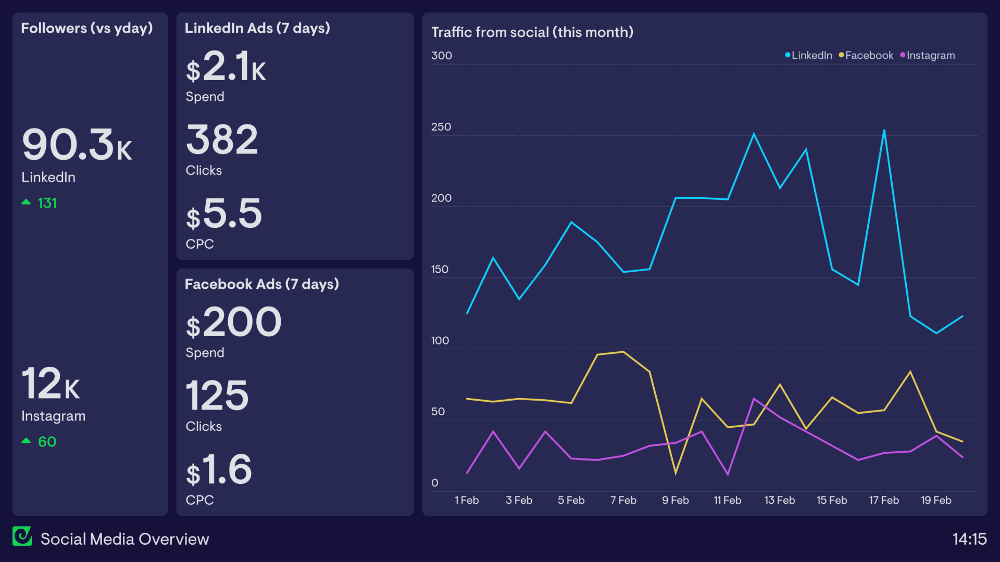

### **1. Explain how social media is beneficial for business growth. [May 2024]**

Social media is highly beneficial for business growth because it aligns with core organizational objectives across several functional areas. Businesses can leverage social media for growth in the following ways:

* **Marketing and Advertising:** Businesses use social media platforms to reach potential customers and actively promote their products or services. This includes establishing a brand presence, posting engaging content, and running targeted advertisements.
* **Customer Service:** Social media acts as a direct channel to provide customer support. Businesses can monitor platforms for brand mentions, answer customer questions, and resolve complaints or issues in real-time.
* **Public Relations:** It allows organizations to manage their online reputation and communicate directly with the public. This includes responding to negative reviews and sharing official news or business updates.
* **Talent Recruitment:** Companies use social media networks (like LinkedIn) to find and attract potential employees by posting job openings and engaging directly with candidates.
* **Lead Generation:** Businesses connect with potential customers and generate new sales leads by sharing valuable content and offering incentives in exchange for user contact information.
* **Market Research:** Social media provides a vast pool of data to gather insights about customer behavior, track competitors, and monitor industry trends through conversation tracking and surveys.
* **Product Development:** Organizations use these platforms to gather direct feedback and solicit innovative ideas for new products or features by actively asking for customer input.

---

### **2. Explain the four steps in social media risk management. [May 2024]**

Managing social media risks requires a proactive social media crisis management loop. This framework consists of four iterative steps:

* **Step 1: Risk Identification** 
    * This is the process of identifying potential social media threats (both accidental and malicious) in terms of vulnerabilities and exploits that could negatively impact the organization. 
    * Common risks identified at this stage include damage to reputation, release of confidential information, hacking, phishing, identity theft, and legal or compliance violations.
* **Step 2: Risk Assessment** 
    * Once risks are identified, this step involves assessing the probabilities and consequences of those risk events if they are actually realized.
    * The assessment determines the likelihood (probability of occurrence) and the resulting impact (ranging from severe to minimal) on the organization. Based on this, risks are prioritized as High, Medium, or Low.
* **Step 3: Risk Mitigation** 
    * In this stage, the prioritized risks are physically, technically, and procedurally managed, eliminated, or reduced to an acceptable level.
    * Typical mitigation strategies include establishing risk management governance, providing employee training and awareness, creating a strict social media policy, and securing platforms (using strong passwords and two-mode authentication)
* **Step 4: Risk Evaluation** 
    * Because social media risk management is a continuous process, risks must be periodically reviewed in the face of rapid technological, political, and social changes.
    * This continuous monitoring ensures that the initial assumptions about internal and external risks remain relevant and that mitigation strategies are updated accordingly.

---

### **3. What are different social media KPIs? [May 2024]**

Social Media Key Performance Indicators (KPIs) are specific metrics used to track the performance and success of a business's social media efforts. The primary social media KPIs include:

* **Reach:** The total number of unique people who see a business's social media content, including followers, friends, and other users who happen to come across it.
* **Engagement:** The measurable level of interaction with a business's content, which includes actions such as likes, comments, shares, and retweets taken by users.
* **Traffic:** The volume of users who actively click on links embedded in a business's social media posts and visit the company's official website.
* **Conversion Rate:** The percentage of users who take a specific, desired action after visiting the business's website via social media, such as making a product purchase or signing up for a newsletter.
* **Customer Satisfaction:** A measure of how satisfied customers are, typically gauged through direct social media interactions, feedback, or online surveys.
* **Lead Generation:** The total number of concrete leads generated through social channels, such as users providing their contact details in exchange for a resource or promotional offer.
* **Return on Investment (ROI):** The ultimate financial return on the social media campaign, calculated as the profit gained divided by the total cost invested in the social media efforts.
* **Cost per Acquisition (CPA):** The specific cost associated with acquiring one new customer through social media, calculated by dividing the total campaign cost by the number of new customers acquired.

---

### **1. Elaborate on Social media issues and privacy policies. [May 2024]**

Social media platforms present complex issues regarding the privacy of personal information. The visibility of a user's data to others online is determined by the platform's default privacy settings. However, privacy settings are just one piece of the puzzle, as they generally only affect what other users are able to see on a person’s profile.

The more critical issues surrounding data collection, usage, and sharing with other companies are rarely controlled through privacy settings, but are instead detailed in privacy policies. The primary issues addressed in these policies include:
* **What data is collected:** To establish an account, websites typically require an email address and a name. They may also collect location data, photos, birthdays, and user-generated posts.
* **How the data is collected:** Data is collected during registration or by requiring users to link to other social networking accounts, which provides an additional source from which websites can harvest data.
* **Who the data is shared with:** Policies stipulate whether data is available to everyone on the Internet or restricted to specific people. They also detail which third parties, such as marketing firms or data analysts, can access the data. The hosting company may sell their users’ personal data or give some of it away for free.
* **How the data is used:** Personal information is used to register users, provide communication, offer customer service, personalize experiences, and make recommendations. 
* **User control and data retention:** Policies address what rights users have if they delete their account. Some sites will delete all user data, while others will keep archived copies for a fixed timeframe or in perpetuity[cite: 1190, 1191].

Furthermore, social media presents severe issues regarding aggregation and data mining. Anonymity is difficult to maintain because pieces of information that appear meaningless can be combined to reveal a person’s identity. Techniques also exist to infer hidden personal information—such as a user's political leanings or sexual orientation—based simply on their social network connections and \"following\" relationships.

---

### **2. Write a short note on: Applications of Social Media Analytics. [May 2024]**

The main premise of social media analytics is to enable informed and insightful decision-making by leveraging social media data. Businesses use these analytics to answer critical questions, such as identifying what customers are saying about a brand, determining social media trends, mapping the geographical location of customers, and identifying influential social media followers.

The primary applications of social media analytics align directly with core business objectives across various domains:
* **Marketing and advertising:** Businesses use social media to reach potential customers and promote products by creating a brand presence, posting content, and running targeted advertisements.
* **Customer service:** Analytics allow businesses to provide support by monitoring social media for mentions of the business and responding to customer inquiries or complaints in real time.
* **Public relations:** Social media is applied to manage reputation and communicate with the public, which involves responding to negative reviews and sharing business updates.
* **Talent recruitment:** Organizations use social platforms to find and attract potential employees by posting job openings and engaging with candidates.
* **Lead generation:** Businesses connect with potential customers to generate leads by sharing valuable content and offering incentives in exchange for user contact information.
* **Market research:** Analytics gather insights regarding customers, competitors, and industry trends by monitoring online conversations and conducting surveys.
* **Product development:** Organizations solicit ideas for new products or features by actively engaging with customers and asking for their input.

---

### **3. Explain data privacy, privacy policies and settings, and issues related to data ownership on social media. How can individuals protect their personal data? [May 2025]**

**Data Privacy, Policies, and Settings**
On social media platforms, privacy settings and privacy policies serve two distinct functions. Privacy settings determine how visible a user's data is to other individuals online. These controls vary widely; some sites offer sophisticated tools to restrict information to specific lists of people, while others offer no privacy options at all. However, these settings generally only affect what other users can see on a profile. 

Privacy policies, conversely, dictate how the hosting company itself handles the data. These policies address what personal data is collected, how it is used for personalization or customer service, which third parties it is shared with or sold to, and what happens to the data if a user decides to delete their account.

**Issues Related to Data Ownership**
A major issue in social media is determining who actually owns the uploaded data. Different websites employ vastly different ownership models:
* Some platforms, like Flickr, allow users to retain full ownership of everything they share and offer options to dictate how others may use their content.
* Other sites, such as Wikipedia, require authors to give up ownership of their content entirely as soon as it is posted.
* Many platforms, like Facebook, technically allow users to maintain ownership, but the terms of service grant the company a transferable, sub-licensable, royalty-free, worldwide license to use the content. This allows the company to do whatever it wants with the data, including selling it, without paying the user or asking for consent. 

This ownership model exists because free social media platforms rely on advertising to make money. They offer advertisers the opportunity to target specific demographics based on the uploaded data, meaning social media users are actually the product, not the customers.

**How Individuals Can Protect Their Personal Data**
To maintain privacy online, individuals can employ several personal strategies:
* **Assume Maximum Visibility:** By default, individuals should assume that anything they post could find its way to their boss, potential employers, friends, and people who do not like them.
* **Evaluate Repercussions:** Before posting, individuals must consider the repercussions of the information reaching a large audience and decide what they are truly comfortable sharing.
* **Understand Policies:** Users must be fully informed about who can see their information, how it can be used, and what the website’s privacy policy entails to make the best decisions.
* **Acknowledge Permanence:** Individuals must remember that once content is shared online, it can never be fully retracted.

---

### **1. Discuss the key steps involved in Formulating a Social Media Strategy and highlight how organizations can Manage Social Media Risks effectively. [May 2025]**

#### **Part A: Key Steps in Formulating a Social Media Strategy**
A social media strategy is a comprehensive plan that outlines how an organization will use social media to achieve its broader business goals. Formulating this strategy involves a structured, step-by-step approach:

**1. Define Business Objectives and Goals:**
* The first and most critical step is ensuring the social media strategy aligns with the company’s broader goals. 
* Objectives should follow the **SMART** framework (Specific, Measurable, Achievable, Relevant, and Time-bound). 
* *Examples:* Increase brand awareness by 20%, generate 50 new sales leads per month, or reduce customer service response time.

**2. Identify and Understand the Target Audience:**
* Organizations must create detailed \"buyer personas\" to understand who they are talking to. 
* This involves analyzing demographic data (age, location, income) and psychographic data (interests, behaviors, pain points) to tailor the messaging effectively.

**3. Select the Right Social Media Platforms:**
* Not all platforms are suitable for every business. The choice depends entirely on where the target audience spends their time.
* *Example:* LinkedIn is ideal for B2B networking and recruitment, while Instagram and Pinterest are better for highly visual B2C products (like fashion or food).

**4. Develop a Content Strategy:**
* This defines *what* the organization will post, the tone of voice, and the posting schedule.
* It involves creating a \"Content Calendar\" that dictates a mix of promotional, educational, and entertaining content to keep the audience engaged without overwhelming them with sales pitches.

**5. Allocate Resources and Assign Roles:**
* A strategy requires a budget (for paid ads, analytics tools, and content creation) and dedicated personnel.
* Roles must be clearly defined, such as who creates the content, who responds to customer queries, and who analyzes the data.

**6. Measure, Analyze, and Adjust:**
* The final step is continuous. Organizations must use social media analytics tools to track performance against the initial SMART goals and tweak the strategy based on what the data shows.

#### **Part B: Managing Social Media Risks Effectively**
As established in the Social Media Risk Management loop, organizations can manage risks through a four-step iterative process:
* **Step 1: Risk Identification:** Recognize potential threats, including reputational damage (viral negative reviews), data breaches, employee misconduct online, or legal/compliance violations.
* **Step 2: Risk Assessment:** Evaluate each identified risk based on its probability of occurring and the severity of its potential impact on the business. Prioritize them as High, Medium, or Low.
* **Step 3: Risk Mitigation:** Implement controls to reduce risks. This includes creating a strict **Corporate Social Media Policy**, training employees on digital etiquette, securing accounts with Two-Factor Authentication (2FA), and establishing a Crisis Communication Plan.
* **Step 4: Risk Evaluation:** Continuously monitor the social media landscape and audit security practices, as new digital threats evolve rapidly.

---

### **2. Explain the importance of Understanding Social Media and Business Alignment, and describe key Social Media KPIs used to measure performance. [May 2025]**

#### **Part A: Importance of Social Media and Business Alignment**
Historically, many companies treated social media as an isolated IT or marketing experiment. However, for a social media strategy to be truly successful and deliver Return on Investment (ROI), it must be tightly aligned with the organization's core business functions. 

The importance of this alignment includes:
* **Goal Synergy:** Social media should not have goals that exist in a vacuum (e.g., just \"getting likes\"). If the corporate goal is to increase market share, the social media goal must be aggressively generating leads and converting sales. 
* **Resource Justification:** Executive boards will only allocate budget and manpower to social media teams if they can clearly demonstrate how their digital efforts contribute to the bottom line (revenue growth or cost reduction).
* **Consistent Brand Identity:** Alignment ensures that the messaging, tone, and customer service provided on social media perfectly match the experience a customer would get in a physical store or on the official corporate website.
* **Cross-Departmental Collaboration:** True alignment means social media data is shared across the company. For example, customer complaints on Twitter are immediately routed to the Customer Service department, and product feature requests mentioned on Facebook are sent to the R&D department.

#### **Part B: Key Social Media KPIs Used to Measure Performance**
Key Performance Indicators (KPIs) are the specific, quantifiable metrics used to evaluate the success of the aligned social media strategy. The most critical KPIs include:

**1. Reach and Awareness Metrics:**
* **Reach:** The total number of *unique* users who have seen a piece of content. 
* **Impressions:** The total number of times a post was displayed on screens, regardless of whether it was clicked or not.

**2. Engagement Metrics:**
* **Engagement Rate:** The percentage of the audience that actively interacted with the content (calculated by dividing total interactions by total reach).
* **Interactions:** Measurable actions such as Likes, Comments, Shares, Saves, and Retweets. High engagement indicates that the content resonates strongly with the audience.

**3. Conversion and Sales Metrics:**
* **Click-Through Rate (CTR):** The percentage of users who clicked on a link in the social media post to visit the company's website or landing page.
* **Conversion Rate:** The percentage of users who, after clicking the link, completed a desired business action (e.g., buying a product, downloading a whitepaper, or subscribing to a newsletter).
* **Cost Per Acquisition (CPA):** The financial cost of acquiring one new paying customer through social media advertising.

**4. Customer Loyalty and Sentiment Metrics:**
* **Customer Sentiment:** Measured via Text Analytics (NLP), this tracks whether the online conversation surrounding the brand is generally positive, negative, or neutral.
* **Response Time:** A critical customer service KPI measuring how quickly the brand replies to user queries or complaints on social platforms.

---

### **1. Case Study: Effective Use of Social Media in the Public Sector [May 2025]**

While many case studies exist, a prominent example in the public sector is the use of social media for **Disaster Management and Public Safety** (often referred to as the **\"Agos\"** platform or similar government-led initiatives).

**The Case: Social Media for Disaster Risk Reduction (DRR)**
* **The Context:** Public sector organizations (like municipal corporations or disaster management cells) use social media to manage crises such as floods, cyclones, or health emergencies.
* **Layer Used:** This utilizes **Location Analytics (Layer Six)** and **Action Analytics (Layer Three)**.
* **Effective Implementation:**
    1.  **Real-Time Information Dissemination:** During a crisis, the government uses X (Twitter) and Facebook to broadcast live alerts about weather changes, evacuation routes, and emergency contact numbers. This is a \"Many-to-Many\" communication approach.
    2.  **Crowdsourcing via Geotagging:** By monitoring hashtags (e.g., #MumbaiFloods) and geotagged posts, the public sector can map \"hotspots\" where citizens are stranded. This is a form of **Social Media-Driven Location Analytics**.
    3.  **Two-Way Interaction:** Unlike traditional TV broadcasts, social media allows citizens to report local issues (e.g., fallen trees, power outages) directly to the authorities, who can then deploy resources based on the volume of reports.
* **Outcome:** The use of social media reduces response time, minimizes rumors through official verification, and saves lives by providing a direct line of communication between the state and its citizens.

---

### **2. Measuring Success and the Importance of Interaction & Monitoring [May 2025]**

#### **Part A: How Businesses Measure Success**
Businesses measure the success of social media initiatives by evaluating **Social Media KPIs** (Key Performance Indicators) against their initial business objectives.

* **Reach & Awareness:** Measured by **Impressions** and **Follower Growth**. Success here means the brand is becoming more visible to a larger audience.
* **Engagement:** Measured by **Actions** (Likes, Shares, Comments, Retweets). This indicates how relevant and \"sticky\" the content is. The **Engagement Rate** (Total Interactions / Total Reach) is a standard success metric.
* **Conversion:** Measured by **Click-Through Rate (CTR)** and **Conversion Rate**. This is the ultimate measure of ROI, showing how many social media users actually performed a business action, such as buying a product or signing up.
* **Sentiment Analysis:** Using **Text Analytics**, businesses measure the \"Net Sentiment\" (Percentage of Positive Mentions vs. Negative Mentions) to gauge brand health.

#### **Part B: Importance of Interaction and Monitoring**

**1. Importance of Interaction:**
Social media is fundamentally **conversational** and **participatory**. 
* **Humanizing the Brand:** Frequent interaction (replying to comments, engaging in threads) makes a business appear more relatable and trustworthy, which builds long-term customer loyalty.
* **Feedback Loop:** Interaction acts as an informal focus group. By asking questions and responding to feedback, businesses can get ideas for new products or improvements directly from their users.
* **Algorithm Favorability:** Most social media algorithms (like Instagram or Facebook) prioritize content that has high interaction. More replies and conversations signal to the platform that the content is valuable, leading to higher organic reach.

**2. Importance of Monitoring:**
Monitoring is the **\"Listening\"** phase of social media strategy.
* **Crisis Prevention:** Continuous monitoring allows a business to spot a negative trend or a customer complaint before it goes viral. Early intervention can prevent a PR disaster.
* **Competitor Benchmarking:** Monitoring isn't just about your own brand; it's about watching competitors. Understanding what is working for others allows a business to adjust its own strategy.
* **Identifying Influencers:** Through monitoring, businesses can identify \"nodes\" (influential users) who are already talking about their brand and recruit them for advocacy or partnerships.

**Summary for Exams:**
Measuring success requires a balance of **quantitative metrics** (KPIs) and **qualitative insights** (Sentiment). **Interaction** drives growth and loyalty, while **Monitoring** ensures the business remains safe, competitive, and informed about the market landscape.